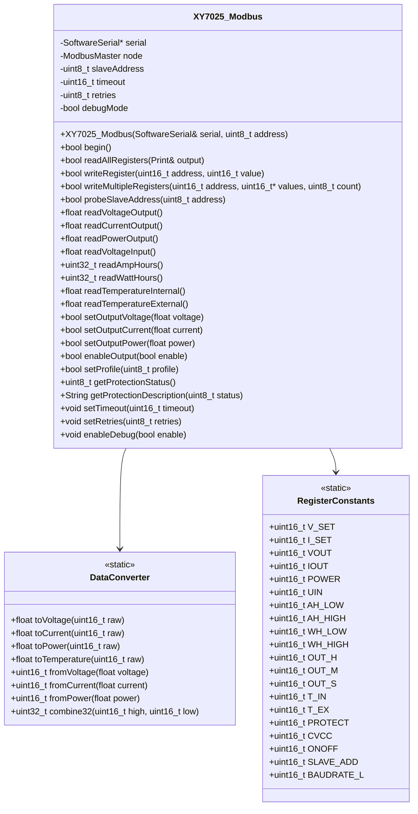

# Arquitectura de la Biblioteca XY7025_Modbus

## Descripción General

Biblioteca Arduino para control del regulador MPPT XY7025 mediante protocolo Modbus RTU sobre SoftwareSerial. Implementa comunicación robusta con manejo de errores, timeout y conversiones de formato para diferentes tipos de datos.

## Requisitos Técnicos

- **Protocolo**: Modbus RTU sobre SoftwareSerial
- **Pinos**: D2 (RX), D3 (TX)
- **Velocidad**: 115200 baudios (configurable)
- **Dirección esclavo por defecto**: 1
- **Offset de registros**: 0 (direcciones directas)
- **Librería base**: ModbusMaster de Doc Walker

## Diagrama de Arquitectura



## Estructura de Archivos

```
XY7025_Modbus/
├── XY7025_Modbus.h          # Definición de la clase y constantes
├── XY7025_Modbus.cpp        # Implementación de métodos
├── ARCHITECTURE.md          # Documentación técnica (este archivo)
└── examples/
    ├── BasicReading/        # Ejemplo de lectura básica
    ├── Configuration/         # Ejemplo de configuración
    └── MultipleDevices/       # Ejemplo de múltiples dispositivos
```

## Constantes de Registros

### Registros de Monitoreo (0x0000-0x0023)

```cpp
// Configuración actual
static const uint16_t XY7025_V_SET        = 0x0000;  // Voltaje configurado (2 decimales)
static const uint16_t XY7025_I_SET        = 0x0001;  // Corriente configurada (3 decimales)

// Lecturas en tiempo real
static const uint16_t XY7025_VOUT         = 0x0002;  // Voltaje de salida (2 decimales)
static const uint16_t XY7025_IOUT         = 0x0003;  // Corriente de salida (3 decimales)
static const uint16_t XY7025_POWER        = 0x0004;  // Potencia de salida (2 decimales)
static const uint16_t XY7025_UIN          = 0x0005;  // Voltaje de entrada (2 decimales)

// Acumuladores (32 bits, divididos en alta/baja)
static const uint16_t XY7025_AH_LOW       = 0x0006;  // Amperios-hora (parte baja)
static const uint16_t XY7025_AH_HIGH      = 0x0007;  // Amperios-hora (parte alta)
static const uint16_t XY7025_WH_LOW       = 0x0008;  // Vatios-hora (parte baja)
static const uint16_t XY7025_WH_HIGH      = 0x0009;  // Vatios-hora (parte alta)

// Tiempo de operación
static const uint16_t XY7025_OUT_H        = 0x000A;  // Horas activo
static const uint16_t XY7025_OUT_M        = 0x000B;  // Minutos activo
static const uint16_t XY7025_OUT_S        = 0x000C;  // Segundos activo

// Temperaturas
static const uint16_t XY7025_T_IN         = 0x000D;  // Temperatura interna (1 decimal)
static const uint16_t XY7025_T_EX         = 0x000E;  // Temperatura externa (1 decimal)

// Estado y control
static const uint16_t XY7025_LOCK        = 0x000F;  // Bloqueo de teclado
static const uint16_t XY7025_PROTECT     = 0x0010;  // Estado de protecciones
static const uint16_t XY7025_CVCC         = 0x0011;  // Modo de carga (0=CV, 1=CC)
static const uint16_t XY7025_ONOFF        = 0x0012;  // Estado de salida
static const uint16_t XY7025_F_C          = 0x0013;  // Escala de temperatura
static const uint16_t XY7025_B_LED        = 0x0014;  // Brillo de pantalla
static const uint16_t XY7025_SLEEP        = 0x0015;  // Tiempo de apagado de pantalla

// Información del dispositivo
static const uint16_t XY7025_MODEL        = 0x0016;  // Modelo del producto
static const uint16_t XY7025_VERSION      = 0x0017;  // Versión de firmware
static const uint16_t XY7025_SLAVE_ADD    = 0x0018;  // Dirección del esclavo
static const uint16_t XY7025_BAUDRATE_L    = 0x0019;  // Tasa de baudios

// Ajustes de temperatura
static const uint16_t XY7025_T_IN_OFFSET  = 0x001A;  // Offset temperatura interna
static const uint16_t XY7025_T_EX_OFFSET  = 0x001B;  // Offset temperatura externa

// Control adicional
static const uint16_t XY7025_BUZZER       = 0x001C;  // Estado del buzzer
static const uint16_t XY7025_EXTRACT_M    = 0x001D;  // Perfil predefinido (0-9)
static const uint16_t XY7025_DEVICE       = 0x001E;  // Estado del dispositivo
static const uint16_t XY7025_MPPT_SW      = 0x001F;  // Habilitar MPPT
static const uint16_t XY7025_MPPT_K      = 0x0020;  // Factor de calibración MPPT
static const uint16_t XY7025_BATFUL      = 0x0021;  // Corriente fin de carga
static const uint16_t XY7025_CW_SW       = 0x0022;  // Habilitar potencia constante
static const uint16_t XY7025_CW          = 0x0023;  // Potencia constante objetivo
```

### Registros de Perfiles (0x0050-0x00ED)

```cpp
// Perfil M0 (registros 0x0050-0x005D)
static const uint16_t XY7025_M0_V_SET     = 0x0050;  // Voltaje objetivo M0
static const uint16_t XY7025_M0_I_SET     = 0x0051;  // Corriente objetivo M0
static const uint16_t XY7025_M0_S_LVP     = 0x0052;  // Protección subtensión M0
static const uint16_t XY7025_M0_S_OVP     = 0x0053;  // Protección sobretensión M0
static const uint16_t XY7025_M0_S_OCP     = 0x0054;  // Protección sobrecorriente M0
static const uint16_t XY7025_M0_S_OPP     = 0x0055;  // Protección sobrepotencia M0
static const uint16_t XY7025_M0_S_OHP_H   = 0x0056;  // Límite tiempo horas M0
static const uint16_t XY7025_M0_S_OHP_M   = 0x0057;  // Límite tiempo minutos M0
static const uint16_t XY7025_M0_S_OAH_L   = 0x0058;  // Contador AH bajo M0
static const uint16_t XY7025_M0_S_OAH_H   = 0x0059;  // Contador AH alto M0
static const uint16_t XY7025_M0_S_OWH_L   = 0x005A;  // Contador WH bajo M0
static const uint16_t XY7025_M0_S_OWH_H   = 0x005B;  // Contador WH alto M0
static const uint16_t XY7025_M0_S_OTP     = 0x005C;  // Temperatura máxima M0
static const uint16_t XY7025_M0_S_INI     = 0x005D;  // Estado inicial M0

// Fórmula para perfiles M1-M9: 0x0050 + (perfil * 0x0010) + offset
#define XY7025_PROFILE_REGISTER(perfil, offset) (0x0050 + (perfil * 0x0010) + offset)
```

## Funciones de Conversión de Datos

### Formatos de Datos

- **Voltaje**: 2 decimales (ej: 24.56V → 2456)
- **Corriente**: 3 decimales (ej: 1.234A → 1234)
- **Potencia**: 2 decimales (ej: 123.45W → 12345)
- **Temperatura**: 1 decimal (ej: 85.2°C → 852)
- **Energía**: Valores brutos (multiplicar WH × 10)

### Funciones Auxiliares

```cpp
class DataConverter {
public:
    // Conversión de raw a valores reales
    static float toVoltage(uint16_t raw) {
        return raw / 100.0;      // 2 decimales
    }
    
    static float toCurrent(uint16_t raw) {
        return raw / 1000.0;     // 3 decimales
    }
    
    static float toPower(uint16_t raw) {
        return raw / 100.0;      // 2 decimales
    }
    
    static float toTemperature(uint16_t raw) {
        return raw / 10.0;       // 1 decimal
    }
    
    // Conversión de valores reales a raw
    static uint16_t fromVoltage(float voltage) {
        return (uint16_t)(voltage * 100);
    }
    
    static uint16_t fromCurrent(float current) {
        return (uint16_t)(current * 1000);
    }
    
    static uint16_t fromPower(float power) {
        return (uint16_t)(power * 100);
    }
    
    // Combinación de registros de 32 bits
    static uint32_t combine32(uint16_t high, uint16_t low) {
        return ((uint32_t)high << 16) | low;
    }
};
```

## Manejo de Errores

### Códigos de Error Modbus

```cpp
// Códigos de error estándar de ModbusMaster
const uint8_t XY7025_SUCCESS           = 0x00;  // Éxito
const uint8_t XY7025_INVALID_CRC       = 0xE2;  // CRC inválido
const uint8_t XY7025_RESPONSE_TIMEOUT  = 0xE1;  // Timeout
const uint8_t XY7025_ILLEGAL_FUNCTION   = 0x01;  // Función no soportada
const uint8_t XY7025_ILLEGAL_ADDRESS    = 0x02;  // Dirección inválida
const uint8_t XY7025_ILLEGAL_VALUE      = 0x03;  // Valor inválido
```

### Estados de Protección

```cpp
// Decodificación del registro PROTECT (0x0010)
const uint8_t PROTECT_NORMAL            = 0;   // Funcionamiento normal
const uint8_t PROTECT_OVP                = 1;   // Sobretensión
const uint8_t PROTECT_OCP                = 2;   // Sobrecorriente
const uint8_t PROTECT_OPP                = 3;   // Sobrepotencia
const uint8_t PROTECT_LVP                = 4;   // Subtensión
const uint8_t PROTECT_OAH                = 5;   // Límite capacidad AH
const uint8_t PROTECT_OHP                = 6;   // Límite tiempo operación
const uint8_t PROTECT_OTP                = 7;   // Sobretemperatura
const uint8_t PROTECT_OEP                = 8;   // Sin salida
const uint8_t PROTECT_OWH                = 9;   // Límite energía WH
const uint8_t PROTECT_ICP                = 10;  // Límite corriente entrada
const uint8_t PROTECT_ETP                = 11;  // Temperatura externa
```

## Implementación de Métodos Principales

### Constructor y Configuración

```cpp
XY7025_Modbus::XY7025_Modbus(SoftwareSerial& serial, uint8_t address = XY7025_DEFAULT_SLAVE_ADDRESS) {
    this->serial = &serial;
    this->slaveAddress = address;
    this->timeout = 1000;     // 1 segundo por defecto
    this->retries = 3;        // 3 reintentos por defecto
    this->debugMode = false;
}

bool XY7025_Modbus::begin() {
    serial->begin(115200);
    node.begin(slaveAddress, *serial);
    node.setTimeout(timeout);
    return true;
}
```

### Lectura de Todos los Registros

```cpp
bool XY7025_Modbus::readAllRegisters(Print& output) {
    // Leer registros de estado básico (0x0000-0x0005)
    if (readHoldingRegisters(0x0000, 6)) {
        float voltajeConfig = DataConverter::toVoltage(getResponseBuffer(0));
        float corrienteConfig = DataConverter::toCurrent(getResponseBuffer(1));
        float voltajeSalida = DataConverter::toVoltage(getResponseBuffer(2));
        float corrienteSalida = DataConverter::toCurrent(getResponseBuffer(3));
        float potenciaSalida = DataConverter::toPower(getResponseBuffer(4));
        float voltajeEntrada = DataConverter::toVoltage(getResponseBuffer(5));
        
        output.print("Voltaje Config: "); output.print(voltajeConfig); output.println("V");
        output.print("Corriente Config: "); output.print(corrienteConfig); output.println("A");
        output.print("Voltaje Salida: "); output.print(voltajeSalida); output.println("V");
        output.print("Corriente Salida: "); output.print(corrienteSalida); output.println("A");
        output.print("Potencia Salida: "); output.print(potenciaSalida); output.println("W");
        output.print("Voltaje Entrada: "); output.print(voltajeEntrada); output.println("V");
        return true;
    }
    return false;
}
```

### Escritura de Registros

```cpp
bool XY7025_Modbus::writeRegister(uint16_t address, uint16_t value) {
    uint8_t result = node.writeSingleRegister(address, value);
    
    if (result == node.ku8MBSuccess) {
        if (debugMode) {
            Serial.print("Registro 0x"); Serial.print(address, HEX);
            Serial.print(" escrito con valor: "); Serial.println(value);
        }
        return true;
    } else {
        if (debugMode) {
            Serial.print("Error escribiendo registro 0x"); Serial.print(address, HEX);
            Serial.print(": 0x"); Serial.println(result, HEX);
        }
        return false;
    }
}
```

### Funciones de Conveniencia

```cpp
float XY7025_Modbus::readVoltageOutput() {
    if (readHoldingRegisters(XY7025_VOUT, 1)) {
        return DataConverter::toVoltage(getResponseBuffer(0));
    }
    return -1.0; // Valor de error
}

bool XY7025_Modbus::setOutputVoltage(float voltage) {
    uint16_t value = DataConverter::fromVoltage(voltage);
    return writeRegister(XY7025_V_SET, value);
}

bool XY7025_Modbus::enableOutput(bool enable) {
    return writeRegister(XY7025_ONOFF, enable ? 1 : 0);
}
```

## Consideraciones de Implementación

### 1. Gestión de Memoria
- Usar tipos de datos mínimos (uint8_t, uint16_t)
- Evitar cadenas de caracteres en memoria RAM
- Usar PROGMEM para textos constantes

### 2. Manejo de Timeout
- Implementar timeout configurable
- Reintentos automáticos en caso de error
- Verificación de CRC en cada comunicación

### 3. Seguridad
- Validar rangos de valores antes de escritura
- Verificar estado de protecciones antes de activar salida
- Implementar límites máximos/mínimos para parámetros

### 4. Depuración
- Modo debug para mensajes de estado
- Funciones de utilidad para decodificación de errores
- Logging de operaciones críticas

## Ejemplo de Uso

```cpp
#include <SoftwareSerial.h>
#include <XY7025_Modbus.h>

SoftwareSerial mpptSerial(2, 3); // RX, TX
XY7025_Modbus mppt(mpptSerial, 1); // Dirección esclavo 1

void setup() {
    Serial.begin(9600);
    mppt.begin();
    mppt.enableDebug(true);
}

void loop() {
    // Leer y mostrar todos los registros
    Serial.println("=== Estado del MPPT ===");
    mppt.readAllRegisters(Serial);
    
    // Leer voltaje de salida
    float voltage = mppt.readVoltageOutput();
    Serial.print("Voltaje de salida: ");
    Serial.print(voltage);
    Serial.println("V");
    
    // Configurar voltaje a 24.0V
    if (mppt.setOutputVoltage(24.0)) {
        Serial.println("Voltaje configurado a 24.0V");
    }
    
    // Activar salida
    mppt.enableOutput(true);
    
    delay(5000);
}
```

## Plan de Implementación

### Fase 1: Estructura Básica
- [ ] Crear archivos XY7025_Modbus.h y XY7025_Modbus.cpp
- [ ] Implementar constructor y begin()
- [ ] Definir todas las constantes de registros
- [ ] Implementar funciones básicas de lectura/escritura

### Fase 2: Funciones de Conveniencia
- [ ] Implementar funciones de lectura de voltaje, corriente, potencia
- [ ] Implementar funciones de configuración
- [ ] Crear funciones de conversión de datos
- [ ] Implementar manejo de errores

### Fase 3: Características Avanzadas
- [ ] Implementar lectura de perfiles
- [ ] Añadir funciones de protección y seguridad
- [ ] Implementar modo debug
- [ ] Optimizar uso de memoria

### Fase 4: Testing y Documentación
- [ ] Crear ejemplos de uso
- [ ] Escribir pruebas unitarias
- [ ] Documentar API completa
- [ ] Validar con hardware real

## Referencias

- [Documentación ModbusMaster](https://github.com/4-20ma/ModbusMaster)
- [Especificación Modbus RTU](https://modbus.org/docs/Modbus_over_serial_line_V1_02.pdf)
- [Documentación XY7025](Documentation/PROTOCOLO MODBUS MPPT XY7025.pdf)